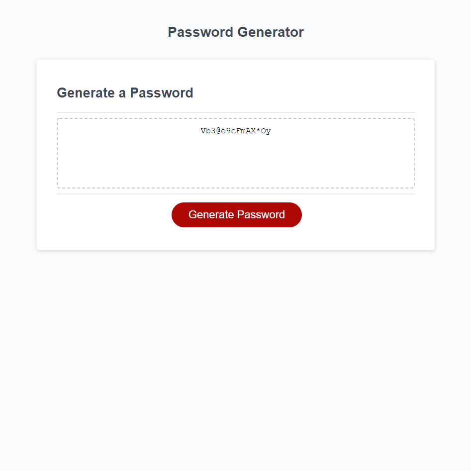

# Password-Generator

## What is the Password Generator project about?

This week’s homework required us to modify starter code to create an application that enables employees to generate random passwords based on criteria that they’ve selected. This app will run in the browser and will feature dynamically updated HTML and CSS powered by JavaScript code that we had to finish and . It will have a clean and polished, responsive user interface that adapts to multiple screen sizes.

## How did I do it?

I first created all of the possible characters into variables.  I then created window prompts to let the user choose what type of symbols, numbers, uppercase, and lowercase characters that they wanted to include.  After they go through the prompts and they select at least one option, it shows them the secure password that has been generated for them.

## Example of a password that could be generated:

## Check out the live website here!

https://k-ryanhunt.github.io/Password-Generator/